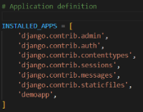

# Django

## Structure

### Project

Every implementation is hold into a project.

- `django-admin startproject my_site`
  

### APP

It's a submodule of a project, self contained add functionality to a specific purpose.

- `python manage.py startapp {app_name}`
  This generate a self contained directory.
  For the app to being recongized as it, inside config/settings.py there's an array of INSTALLED_APPS and it must be passed there.

### Django WEB APP

It's a project with multiple apps inside (features)

## Manage.py

### makemigrations

Django manages the database operations with the ORM technique. Migration refers to generating a database table whose structure matches the data model declared in the app.

- `python manage.py makemigrations`
  this command should be always run whenever a new model is declared

### migrate

- `python manage.py migrate`
  this command synchronizes the database state with the currently declared models and migrations

### runserver

- `python manage.py runserver`
  this command starts a Django's built-in development server on the local machine IP = 127.0.0.1:8000

### shell

- `python manage.py shell`
  this opens up an interactive python shell inside the project. Useful for some quick interactive operations.

## Setting.py

Django configures specific parameters with their default values and puts them in this file.
The django-admin utility and manage.py script use these settings while performing various administrative tasks.
Defines the attributes that influence the function of a Django App.

### INSTALLED_APPS

This is a list of strings. Each string represents the path of an app inside the parent project folder. The startproject template installs some apps by default. This list should be updated when startapp command is executed.

- `python manage.py startapp demoapp`
  

## Urls.py

This script contains a list of object urlpatterns. Every time the client browser requests a URL, the Django server looks to match its pattern and routes the application to the mapped view.

## Asgi.py

This file is used by the application servers following the ASGI standard to serve asynchronous web applications.

## Wsgi.py

Many web application servers implement the WSGI standard. This script is the entry point for such WSGI-compatible servers to serve your classical web application.
